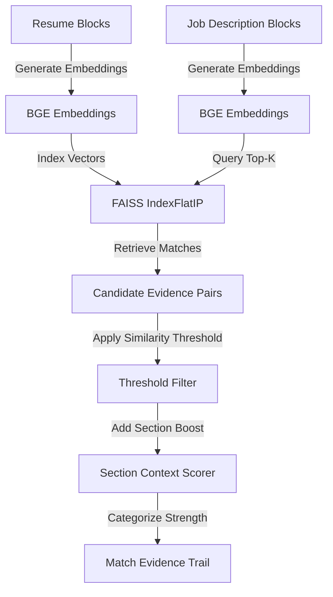

# Matching Logic & Explainability Architecture

Resume Matcher uses a 100% deterministic, explainable, and auditable matching pipeline. It explicitly avoids black-box LLMs, hallucinated scores, and arbitrary keyword dictionaries.

---

## 1. Mathematical Foundation

### Cosine Similarity via Inner Product

Given two vectors $\mathbf{u}$ and $\mathbf{v}$ generated by `BAAI/bge-base-en-v1.5`, the cosine similarity is defined as:

$$\text{Cosine Similarity}(\mathbf{u}, \mathbf{v}) = \frac{\mathbf{u} \cdot \mathbf{v}}{\|\mathbf{u}\|_2 \|\mathbf{v}\|_2}$$

Because all embeddings in Resume Matcher are strictly $L_2$-normalized upon creation ($\|\mathbf{u}\|_2 = 1$), cosine similarity simplifies directly to the inner product:

$$\text{Cosine Similarity}(\mathbf{u}, \mathbf{v}) = \mathbf{u} \cdot \mathbf{v} = \sum_{i=1}^{768} u_i v_i$$

This allows FAISS `IndexFlatIP` to perform exact cosine similarity searches with zero approximation errors in sub-millisecond time.

---

## 2. Evidence Matching Workflow

### Step 1: Segmentation into Semantic Blocks
- Documents are segmented into cohesive blocks (paragraphs, bullet lists, requirement sentences).
- Each block preserves exact line numbers from the original PDF/DOCX file.

### Step 2: Vector Search & Thresholding
- Resume blocks are indexed into FAISS.
- Each JD block queries the FAISS index for the top-$k$ most similar resume blocks.
- Matches below the `similarity_threshold` (default: 0.45) are discarded to eliminate noise.

### Step 3: Section-Aware Score Boosting
- Matches occurring within identical semantic sections (e.g. JD `Education` $\leftrightarrow$ Resume `Education`) receive a deterministic additive boost:
  $$\text{Score}_{\text{final}} = \min(1.0, \text{Score}_{\text{raw}} + 0.05)$$
- Cross-section matches are still retained (e.g., skills mentioned inside work experience bullets) but without the bonus.

### Step 4: Strength Classification
Matches are categorized into discrete tiers:
- **Strong Match:** Cosine similarity $\ge 0.75$
- **Moderate Match:** $0.55 \le \text{Similarity} < 0.75$
- **Weak Match:** $0.35 \le \text{Similarity} < 0.55$

---

## 3. Mandatory Requirements Handling

Requirements containing mandatory language (`must have`, `required`, `essential`, `minimum of`, `proficiency in`) are flagged as **Mandatory Blocks**.

1. Each mandatory block is matched against the candidate resume.
2. If the best match score satisfies $\text{Score} \ge 0.50$, the requirement is marked **MET**.
3. If not met, it is added to `missing_requirements` and prominently flagged for recruiter review.

---

## 4. Complete Auditability

Every score is backed by granular evidence:
- **Exact JD sentence** + source line numbers in the original file
- **Exact Resume sentence** + source line numbers in the original file
- **Cosine similarity score**
- **Human-readable explanation**
- **Uncertainty flag** if score falls near threshold boundaries
